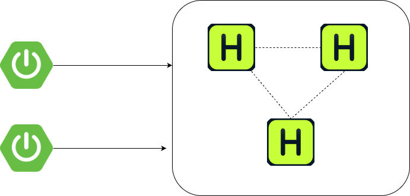

= Configure Hazelcast Spring Session

Hazelcast Spring Session is a library that allows you to store session information from your Spring Boot application in Hazelcast's xref:data-structures:map.adoc[IMap]. This allows you to enhance your application with the benefits of Hazelcast: resilence, high availability and high performance.

== Update dependencies

If you use Maven, add the following dependencies:

[tabs]
====
Maven::
+
.pom.xml
[source,xml]
[subs="verbatim,attributes"]
----
<dependencies>
	<!-- ... -->
	<dependency>
		<groupId>com.hazelcast</groupId>
		<artifactId>hazelcast</artifactId>
		<version>{os-version}</version>
	</dependency>
	<dependency>
		<groupId>org.springframework</groupId>
		<artifactId>spring-web</artifactId>
		<version>7.0.0</version>
	</dependency>
	<dependency>
		<groupId>com.hazelcast</groupId>
		<artifactId>hazelcast-spring-session</artifactId>
		<version>4.0.0</version>
	</dependency>
</dependencies>
----

Gradle (Kotlin)::
+
.build.gradle.kts
[source,kotlin]
[subs="verbatim,attributes"]
----
dependencies {
    implementation("com.hazelcast:hazelcast:{os-version}")
    implementation("org.springframework:spring-web:7.0.0")
    implementation("com.hazelcast:hazelcast-spring-session:4.0.0")
}
----

====

TIP: Hazelcast Spring Session uses the same major version number as Spring Boot it was created for. For Spring Boot 4.x, the compatible Hazelcast Spring Session will be always 4.x.

=== Migrate from Spring Session Hazelcast 3.x

From version 4.0, the Hazelcast integration with Spring Session is owned by the Hazelcast team.

To migrate your application from using Spring Session Hazelcast 3.x to the new Hazelcast Spring Session 4.x:

. Change the GroupId to `com.hazelcast` and artifactId to `hazelcast-spring-session`.
. Update your code and change the packages. All Hazelcast-specific classes were moved from `org.springframework.session.hazelcast` to `com.hazelcast.spring.session`.
. Remove this configuration for `PrincipalNameExtractor`:
+
[source,java]
----
AttributeConfig attributeConfig = new AttributeConfig()
        .setName(Hazelcast4IndexedSessionRepository.PRINCIPAL_NAME_ATTRIBUTE)
        .setExtractorClassName(Hazelcast4PrincipalNameExtractor.class.getName());
config.getMapConfig(SESSIONS_MAP_NAME)
            .addAttributeConfig(attributeConfig);
----
. Change serialization configuration. Replace:
+
[source,java]
----
SerializerConfig serializerConfig = new SerializerConfig();
    serializerConfig.setImplementation(new HazelcastSessionSerializer()).setTypeClass(MapSession.class);
    config.getSerializationConfig().addSerializerConfig(serializerConfig);
----
With a call:
+
[source,java]
----
config = HazelcastSessionConfiguration.applySerializationConfig(config);
----
. Index configuration for `PRINCIPAL_ATTRIBUTE_NAME` **if** no other IMap customization is wanted.

== Supported topologies

Hazelcast Spring Session supports two topologies.

=== Client-server

In this topology, the web application uses xref:clients:client-overview.adoc[Hazelcast clients] to connect to a Hazelcast cluster on a separate JVM. This may be a completely separate machine. xref:maintain-cluster:lite-members.adoc[Lite members] can optionally be used to on the application side.

To deploy in a client-server topology:

* Client side (Spring Boot application):
** Create a `@Bean` of type `ClientConfig` or `HazelcastInstance` that will return the result of `HazelcastClient.newHazelcastClient` method.

* Server side (Hazelcast member). This configuration is optional, but recommended.
** Deploy the Hazelcast Spring Session JAR onto the classpath with Spring context and Spring Security JARs.
** For best performance, add serializers to your Hazelcast configuration:
+
[tabs]
====
XML::
+
--
[source,xml]
----
<serialization>
    <compact-serialization>
        <serializers>
            <serializer>com.hazelcast.spring.session.HazelcastSessionCompactSerializer</serializer>
            <serializer>com.hazelcast.spring.session.AttributeValueCompactSerializer</serializer>
        </serializers>
    </compact-serialization>
</serialization>
----
--

YAML::
+
--
[source,yaml]
----
serialization:
  compact-serialization:
    serializers:
      - serializer: com.hazelcast.spring.session.HazelcastSessionCompactSerializer
      - serializer: com.hazelcast.spring.session.AttributeValueCompactSerializer
----
--

Java::
+
--
[source,java]
----
import com.hazelcast.spring.session.AttributeValueCompactSerializer;
import com.hazelcast.spring.session.HazelcastSessionCompactSerializer;
// ...
config.getSerializationConfig().getCompactSerializationConfig()
            .addSerializer(new AttributeValueCompactSerializer())
            .addSerializer(new HazelcastSessionCompactSerializer());
----

Alternatively, you can use the helper method:
[source,java]
----
import com.hazelcast.spring.session.HazelcastSessionConfiguration;
// ...
HazelcastSessionConfiguration.applySerializationConfig(config);
----
--
====

=== Embedded

In this topology, every web application instance has an embedded Hazelcast instance. Data is stored on the same JVMs as the application.

image:HzSS-Embedded.png[Hazelcast Spring Session with Embedded topology]

This topology is the easiest to start with as it does not require separate cluster JVMs, however it is less flexible because Hazelcast members scale with application instances.

To deploy in an embedded topology, you must configure serialization:
[tabs]
====
Java::
+
--
You can use the helper method (recommended):
[source,java]
----
import com.hazelcast.spring.session.HazelcastSessionConfiguration;
// ...
HazelcastSessionConfiguration.applySerializationConfig(config);
----
Alternatively, you can add specific serializers manually:
[source,java]
----
import com.hazelcast.spring.session.AttributeValueCompactSerializer;
import com.hazelcast.spring.session.HazelcastSessionCompactSerializer;
// ...
config.getSerializationConfig().getCompactSerializationConfig()
            .addSerializer(new AttributeValueCompactSerializer())
            .addSerializer(new HazelcastSessionCompactSerializer());
----
--

XML::
+
--
[source,xml]
----
<serialization>
    <compact-serialization>
        <serializers>
            <serializer>com.hazelcast.spring.session.HazelcastSessionCompactSerializer</serializer>
            <serializer>com.hazelcast.spring.session.AttributeValueCompactSerializer</serializer>
        </serializers>
    </compact-serialization>
</serialization>
----
--

YAML::
+
--
[source,yaml]
----
serialization:
  compact-serialization:
    serializers:
      - serializer: com.hazelcast.spring.session.HazelcastSessionCompactSerializer
      - serializer: com.hazelcast.spring.session.AttributeValueCompactSerializer
----
--

====

[[security-spring-configuration]]
== Configure Spring

Configure Spring to create a servlet filter that replaces the `HttpSession` implementation with an implementation backed by Spring Session. Add the following Spring Configuration:

[source,java]
----
include::ROOT:example$/spring/HazelcastHttpSessionConfig.java[tags=config]
----
<1> The `@EnableHazelcastHttpSession` annotation creates a Spring bean named `springSessionRepositoryFilter` that implements `Filter`.
The filter replaces the `HttpSession` implementation to be backed by Spring Session.
In this instance, Spring Session is backed by Hazelcast.
<2> To serialize `BackingMapSession` objects efficiently, `HazelcastSessionCompactSerializer` and `AttributeValueCompactSerializer` needs to be registered. If this is not set, Hazelcast won't be able to deserialize session data.
<3> For best performance when using Hazelcast Spring Session with Spring Security, an index on `HazelcastIndexedSessionRepository.PRINCIPAL_NAME_ATTRIBUTE` must be added. This step is optional in Hazelcast Spring Session 4.0, as `HazelcastIndexedSessionRepository` will try to add this index automatically. If you want to customize your `MapConfig`, you need to add this index manually as overriding `MapConfig` by `HazelcastIndexedSessionRepository` is not possible.
<4> Create a `HazelcastInstance` that connects Spring Session to Hazelcast.
By default, the application starts and connects to an embedded instance of Hazelcast.

== Customization options

To customize the SessionRepository your application will be using, declare a bean of type `SessionRepositoryCustomizer<HazelcastIndexedSessionRepository>`. For example:

[source,java]
----
@Bean
public SessionRepositoryCustomizer<HazelcastIndexedSessionRepository> customizeSessionRepo() {
    return (sessionRepository) -> {
        // here you can customize sessionRepository by calling the setter methods, for example:
        sessionRepository.setFlushMode(FlushMode.IMMEDIATE);
        sessionRepository.setSaveMode(SaveMode.ALWAYS);
        sessionRepository.setDeployedOnAllMembers(false);
    };
}
----

The following table describes some common customization options:

[cols="1m,1m,3",options="header"]
|===
| Method/property | Default value | Description

| flushMode
| FlushMode.ON_SAVE
| When changes in the session will be persisted. Possible options:

 - `ON_SAVE` - `repository.save()` will persist the changes
 - `IMMEDIATE` - changes will be persisted immediately, without the need to call `repository.save()`

| defaultMaxInactiveInterval
| 30 minutes
| Maximum inactive interval in between requests before the session will be invalidated. A negative time indicates that the session will never time out.

| sessionMapName
| `spring:session:sessions`
| Name of IMap used to store sessions.

| saveMode
| `SaveMode.ON_SET_ATTRIBUTE`
| When changes to session attributes will be saved. Possible values:

 - `ON_SET_ATTRIBUTE` - save only changes made to the session. Best if you want to minimize risk of attribute override in highly concurrent environments.
 - `ON_GET_ATTRIBUTE` - same as `ON_SET_ATTRIBUTE` plus save is performed also on read attributes.
 - `ALWAYS` - always save all session attributes (even when not newly added or read).

| indexResolver
| `new DelegatingIndexResolver<>(new PrincipalNameIndexResolver<>())`
| IndexResolver to use when querying for `FindByIndexNameSessionRepository#PRINCIPAL_NAME_INDEX_NAME`.

| sessionIdGenerator
| `UuidSessionIdGenerator.getInstance()`
| How session IDs for new sessions are generated.

| applicationEventPublisher
| no-op
| Allows setting a custom ApplicationEventPublisher that will be used to publish `AbstractSessionEvent`: `SessionCreatedEvent`,
`SessionExpiredEvent` and `SessionDeletedEvent`.

| disableSessionMapAutoConfiguration
| -
| If called, the autoconfiguration of IMap storing session data won't be performed and index on `HazelcastIndexedSessionRepository#PRINCIPAL_NAME_ATTRIBUTE` will not be created, potentially harming performance of the application. Can be used if you have pre-existing IMap configuration applied and do not want to convert it to `sessionMapConfigCustomizer`.

| sessionMapConfigCustomizer
| ConsumerEx.noop()
| Customizes session map configuration (MapConfig). If using client-server architecture, the customized `MapConfig` will not override pre-existing map configuration.

|===
